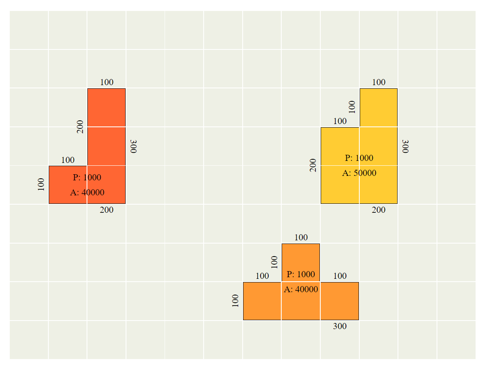
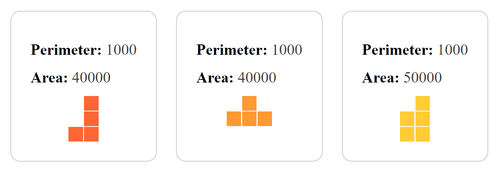

# Grid Area Calculator
[Live Preview](https://deimantedav.github.io/Grid-Area-Calculator/) 🚀

This project is a vanilla JavaScript application for calculating perimeter and area based on a created grid. It utilizes SCSS for styling and JavaScript for functionalities.

## Features 🔍

- **Perimeter and Area Calculation**: Calculate perimeter and area based on the created grid.
- **Individual and Total Figures**: Calculate the total area and perimeter of the entire grid as well as individual figures.
- **Checkbox Inputs**: Grid creation is automated; checkboxes are dynamically generated based on user-defined grid dimensions.
- **Dynamic Element Interaction**: Elements interact dynamically with each other, including color merging and mirroring.
- **Local Storage**: Stores grid data in local storage for persistent data management.
- **Grouping and Mirroring**: Grouping of elements and mirroring functionalities are implemented.

## Visualizations 🎨
- CSS Grid and SCSS for styling, including functions and loops

## Usage 🎮

1. **Setup**: Initialize the grid by specifying the number of rows and columns in the custom size form
2. **Grid Creation**: The grid and checkboxes are automatically generated based on the submitted row and column values
3. **Interaction**: Interact with checkboxes to modify the grid and observe changes
